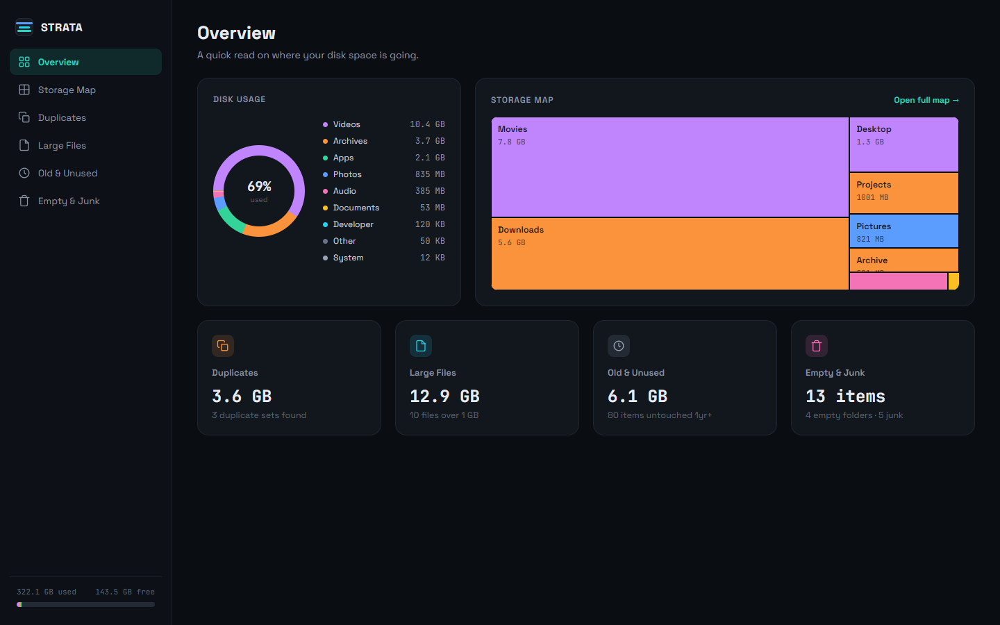
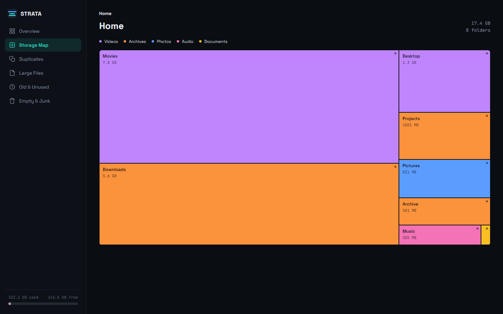
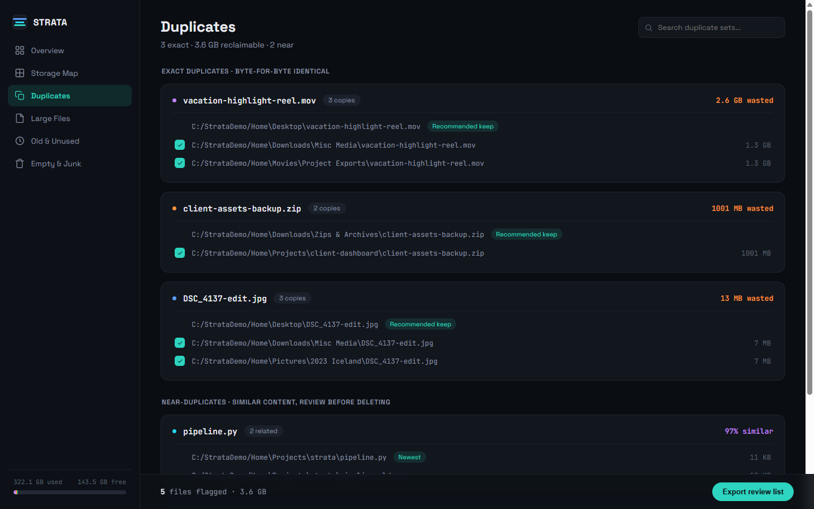
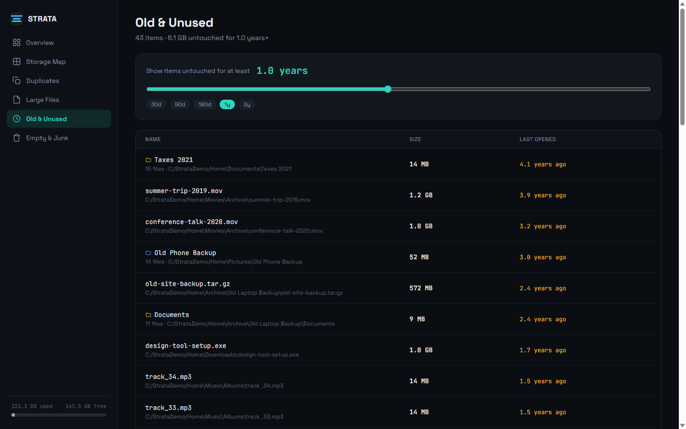
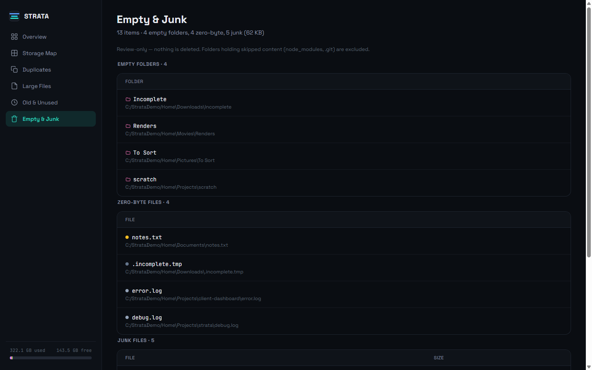

# Strata

**Find out where your disk space actually went.**

Strata scans the folders you point it at and opens a single self-contained HTML
dashboard: what's eating your space, which files are byte-identical copies of
each other, what's enormous, and what you haven't touched in years.

It never moves, deletes, renames, or modifies a single file. It only looks.

Pure Python standard library — no dependencies, no build step, no server, and
nothing ever leaves your machine.



## Install and run

You need Python 3.11 or newer. That's the whole list — no `pip install`, no
virtualenv, no dependencies.

```bash
git clone https://github.com/saltasaurus/fs-audit.git
cd fs-audit
python strata ~/Documents ~/Pictures
```

Pass the folders you want scanned. Strata writes `outputs/audit.html` and opens
it in your browser. Re-run any time to refresh. A whole-profile scan takes a few
minutes; most of that is hashing files that might be duplicates.

### One file, no clone

Download [**strata.pyz**](https://github.com/saltasaurus/fs-audit/releases/latest/download/strata.pyz)
from the latest release and run it:

```bash
python strata.pyz ~/Documents
```

One file with everything inside it, dashboard template included. The same file
works on Windows, macOS, and Linux — anywhere Python 3.11 or newer runs. There
is nothing to install and nothing to unpack.

Or build it yourself from a clone:

```bash
python -m zipapp strata -o strata.pyz
```

### Scanning the same folders often

Rather than retyping paths, list them in a `roots.txt` in the directory you run
Strata from:

```bash
cp roots.example.txt roots.txt
```

```
C:/Users/YourName/Documents/
D:/Projects/
/mnt/c/Users/YourName/          # WSL mount
```

Use forward slashes on every platform; blank lines and `#` comments are ignored.
Then run with no arguments — `python strata` — and it picks the file up.
Explicit arguments always win over the file.

> `roots.txt` is git-ignored, so your folder paths never end up in a commit.

### Options

| Flag | Effect |
|---|---|
| `-o PATH`, `--output PATH` | Write the report somewhere else (default `outputs/audit.html`) |
| `--no-open` | Write the report but don't launch a browser |
| `-v`, `--verbose` | Name every file the scan couldn't read |

If a scan ends by reporting files it couldn't read, they're almost always paths
longer than Windows' 260-character limit — deep caches from game launchers and
build tools are the usual source. Those files aren't counted in any total.

## What you get

### Storage Map

A drill-down treemap of your entire folder tree. Tiles are sized by how much
the folder holds and coloured by what's inside it. Click a tile to go deeper,
use the breadcrumb to climb back out — you bottom out at the actual files.



### Duplicates

Files with **byte-identical content**, grouped into sets — matched by content
hash, not by filename, so `invoice.pdf` and `invoice (1).pdf` are caught, and
two different files that happen to share a name are not.

Strata groups files by size first and only hashes the ones that share a size,
because a file with a unique size can't possibly have a twin. That skips
re-reading the overwhelming majority of your disk.

It also finds **near-duplicates** — drafts and edited copies whose text is
similar but not identical. The copy in the shortest path is marked the
recommended keeper. Tick the ones you don't want and export a plain-text list
to act on yourself.



### Old & Unused

Everything you haven't touched in a long time, with a live slider from 30 days
to 2 years. Folders written in one go — a photo import, an old tax year —
collapse into a single row instead of flooding the list with hundreds of files
that all share a timestamp.



### Empty & Junk

Empty folders, zero-byte files, and OS clutter (`Thumbs.db`, `.DS_Store`,
`desktop.ini`). Only the outermost folder of an empty chain is listed, so one
entry covers the whole dead branch. Folders that merely *look* empty because
Strata skipped their contents are never flagged.



### Large Files

Every file at or above 1 GB, sortable by name, category, size, or age, with
search.

## Nothing is ever deleted

Strata is an auditor, not a cleaner. It shows you what to consider removing and
leaves the removing to you.

- The only file it ever writes is `outputs/audit.html`.
- Symlinks are never followed.
- Folders matching a skip rule are never even opened — by default that's
  `C:/Windows`, `node_modules`, `.git`, `.venv`, `AppData`, and similar noise.
- The report is a single self-contained HTML file. No telemetry, no network
  calls, no accounts.

The "Export review list" button gives you a text file of the copies you flagged.
Nothing acts on it but you.

## Optional tuning

Everything below is optional — `strata/config.py` has sensible defaults. The
knobs worth knowing about:

| Setting | Default | What it does |
|---|---|---|
| `SKIP_PATHS` | Windows, `node_modules`, `.git`, … | Any path containing one of these substrings is never traversed |
| `LARGE_FILE_BYTES` | 1 GB | The "Large Files" cutoff |
| `OLD_FILE_DAYS` | 365 | What counts as untouched |
| `NEAR_DUP_THRESHOLD` | 0.8 | How similar two files must be to be called near-duplicates. Lower toward 0.6 for looser matching |
| `CATEGORY_EXTENSIONS` | — | Which file extensions count as Photos, Videos, Documents, … |

A note on ages: "last touched" uses each file's **modification** time. Access
time looks like the better signal but is unreliable in practice — often
disabled outright, and bumped by backup tools and search indexers that never
really "opened" anything.

## License

MIT — see [LICENSE](LICENSE).
